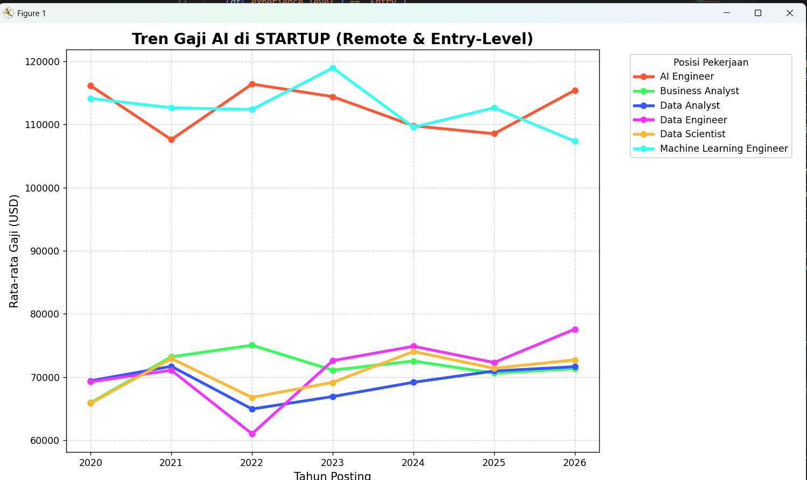

# Analisis-kebutuhan-tenaga-kerja-di-bidang-AI-2020-2026-

Dataset : https://www.kaggle.com/datasets/shree0910/ai-and-data-science-job-market-dataset-20202026

Deskripsi Proyek
Proyek ini menyajikan analisis komprehensif mengenai dinamika pasar kerja di bidang Kecerdasan Buatan (Artificial Intelligence) dengan fokus spesifik pada peluang kerja jarak jauh (remote) bagi tenaga kerja tingkat pemula (entry-level). Dengan memanfaatkan dataset pasar kerja AI global, analisis ini bertujuan untuk memberikan wawasan mendalam mengenai tren kompensasi, stabilitas peran, dan pergeseran permintaan industri selama periode tujuh tahun.

Wawasan Utama (Executive Summary)
Melalui serangkaian visualisasi data menggunakan Python (Pandas & Matplotlib), proyek ini berhasil mengidentifikasi beberapa tren krusial:

Dominasi Peran Inti AI: Posisi AI Engineer dan Machine Learning Engineer secara konsisten menempati hierarki kompensasi tertinggi di sektor Startup, dengan rata-rata gaji tahunan melampaui ambang batas $110.000.

Volatilitas Sektor Startup: Berbeda dengan perusahaan multinasional, sektor Startup menunjukkan volatilitas gaji yang lebih tinggi, yang mencerminkan respons cepat terhadap inovasi teknologi dan kondisi pendanaan ventura.

Kebangkitan Data Engineering: Analisis tren menunjukkan pemulihan dan pertumbuhan konsisten pada peran Data Engineer sejak tahun 2022, mengindikasikan peningkatan kebutuhan infrastruktur data yang matang sebelum implementasi model AI.

Stabilitas Karier: Peran AI Engineer teridentifikasi sebagai posisi yang paling stabil secara finansial, menunjukkan resistensi yang kuat terhadap fluktuasi pasar dibandingkan peran teknis lainnya.

Metodologi Pengolahan Data
Analisis ini dilakukan dengan tahapan sebagai berikut:

Ekstraksi Data: Memuat dataset primer AI_Job_Market_Dataset.csv.

Pembersihan & Transformasi: Melakukan filtrasi berlapis untuk menyaring data berdasarkan kategori Remote (Remote Type), Entry (Experience Level), dan Startup (Company Size).

Agregasi Statistik: Menghitung rata-rata gaji tahunan per posisi pekerjaan menggunakan metode grouping berdasarkan tahun posting.

Visualisasi Data: Mengonstruksi grafik garis (Time-Series Analysis) untuk memetakan lintasan pertumbuhan gaji secara akurat.

Teknologi yang Digunakan
Bahasa Pemrograman: Python

Library Analisis: Pandas

Library Visualisasi: Matplotlib, Seaborn

Environment: Jupyter Notebook